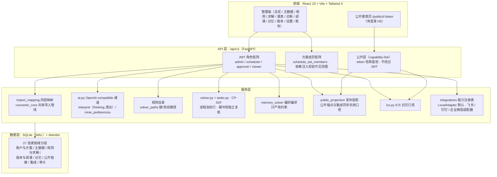
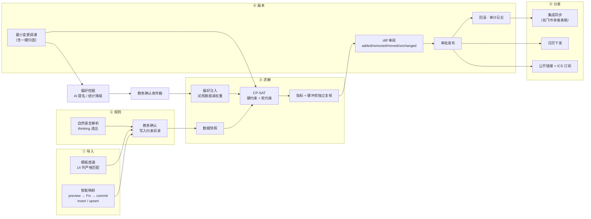

# 架构（ARCHITECTURE.md）

> 面向开发者的系统架构说明。业务能力与上手步骤见根 [README.md](README.md)；分阶段设计调研见 [docs/roadmap/](docs/roadmap/README.md)；平台接入指南见 [docs/integrations/](docs/integrations/README.md)。

## 1. 系统概览

途排智策是一个「AI 理解 + CP-SAT 确定性求解」的学校排课系统。分工是刻意设计的：**LLM 负责理解、归纳与解释——自然语言规则解析、偏好挖掘提名、结果解释措辞；求解器负责正确性——排课本身由 OR-Tools CP-SAT 在硬约束下求解，硬冲突由代码独立于求解器复核**。LLM 的每类输出都有人工确认或白名单校验兜底，未配置模型时核心链路完整可用。

| 层 | 技术 | 说明 |
| --- | --- | --- |
| 后端框架 | Python 3.11 · FastAPI | 业务接口统一在 `/api/v1` 前缀下，OpenAPI 文档由应用导出 |
| ORM / 迁移 | SQLAlchemy 2.x · Alembic | 迁移是唯一建表路径，不做 `create_all` 运行时兜底 |
| 求解器 | OR-Tools CP-SAT | 硬约束强制 + 软约束加权目标，进程池异步执行 |
| 数据库 | SQLite（WAL） | 默认单文件零部署依赖；连接层启用 WAL 与 busy_timeout |
| LLM 通道 | OpenAI-compatible `/chat/completions` | 平台无关，可接豆包 Ark、DeepSeek 或企业模型网关；可选项，未配置自动降级 |
| 前端 | React 19 · Vite · Tailwind CSS 4 | 管理端（13 个页面）+ 公开课表页（免登录 H5） |
| API Client | orval | 由 `openapi.json` 生成的 TypeScript client，单一事实源（见 §5.5） |
| 前端数据层 | TanStack Query · react-router 7 · zod | 服务端状态与路由，表单用 zod 校验 |
| 测试 | pytest · vitest · Playwright | 后端集成测试走真实迁移链路（见 §7） |
| 工具链 | uv（后端）· pnpm（前端）· ruff · mypy | 代码质量约定见 §7 |

## 2. 分层架构



### 2.1 API 层的权限模型

管理端接口由两个正交的矩阵共同约束，前端 `RoleRoute` 只做体验层控制，真实校验全部在后端依赖注入层：

- **角色矩阵**：`admin`（全权）/ `scheduler`（排课操作）/ `approver`（审批发布与回滚）/ `viewer`（只读）。鉴权走 OAuth2 password flow + JWT Bearer。
- **方案成员矩阵**：所有业务数据按课表方案（`schedule_set`）隔离，排课员与成员只能访问管理员在账号管理中授予的方案，`schedule_set_id` 不由前端自行拼接。
- **公开层（capability-link）与管理端 RBAC 正交**：公开端点不声明 `CurrentUser` 依赖即天然绕过 JWT；链接的签发/轮换/停用复用 `admin`/`scheduler` 角色；撤回手段 = 停用/轮换/过期（详见 §5.4）。
- 另有一条可选的 Aily 通道（`X-Aily-Key`），作为自然语言能力的高级接入项，未配置即不可用。

### 2.2 服务层模块

| 模块 | 职责 |
| --- | --- |
| `services/import_mapping.py` | 任意 XLSX/CSV 的四层列映射：Exact/别名 → Normalized（NFKC 归一）→ Fuzzy（difflib）→ 样本形状校验；可选 LLM 语义提名，置信度 < 0.5 一律不匹配 |
| `services/converter_core.py` | 导入核心管线：行级校验、业务键、质量报告；模板直通与智能映射两条入口共用同一套口径 |
| `services/ai.py` | OpenAI-compatible 通道：`interpret`（自然语言 → 业务范围/日期窗口/候选规则，thinking 透出）、`mine_preferences`（模型只提名，主体/谓词/证据按白名单校验，允许弃权） |
| `services/solver.py` + `tasks.py` | CP-SAT 建模与任务编排：约束目录的 `solver_paths` 硬/软双路径、进程池执行、指标计算、硬冲突独立复核、偏好软规则注入 |
| `services/memory_solver.py` | 偏好 → 内部软规则编译器：只把 `confirmed`/`probation` 且未过期的偏好并入现有软约束管线，权重 = `weight × 试用期衰减 × confidence` |
| `services/public_projection.py` | 公开 payload 纯函数（显式字段白名单），公开端点与飞书公开表同步共用同一份投影口径 |
| `services/ics.py` | ICS 订阅生成：`TZID=Asia/Shanghai`、UID 跨版本稳定、`SEQUENCE=version_no`、ETag 支持 304 |
| `app/integrations/` | 集成抽象层：`Capability` 枚举 + `Integration` Protocol + manifest 清单 + 显式 `@register` 注册表；LocalAdapter 默认可用，FeishuAdapter 纯委托 `services/feishu.py`，钉钉/企业微信适配器 v1（各自 `client.py` + `adapter.py`，凭据 Fernet 加密） |
| `services/feishu.py` | 飞书生产逻辑：OAuth、凭据 Fernet 加密、多维表格自动建表与幂等同步、日历、Aily——作为集成层的第一个适配器被消费，不因抽象层重写 |
| `services/explain.py` | 求解解释层：「事实由代码算，措辞由模型写」——确定性事实包 + 不依赖模型的兜底解释，AI 只负责翻译与意图核对 |
| `services/snapshot.py` | 求解前数据快照，保证结果可复现、可解释 |
| `services/overview_analytics.py` | 总览分析口径：教师负荷、教室热力、软约束满足率、同步健康 |
| `services/seed.py` | bootstrap 管理员、默认课表方案与演示数据 |

### 2.3 数据层

SQLite 单文件 + WAL，24 个 Alembic 迁移维护 27 张表。启动守卫（`db.py::require_current_database_schema`）在校验迁移版本落后时拒绝启动并给出升级命令，刻意不做 `create_all` 兜底——部分建表会让下一次 Alembic 升级无法进行。业务时间统一按 `Asia/Shanghai` 展示与落库，协议边界（JWT/OAuth）内部按 UTC 计算。

27 张表按域分组：

| 域 | 表 |
| --- | --- |
| 账户与方案（3） | `users` · `schedule_sets` · `schedule_set_members` |
| 主数据（6） | `campuses` · `teachers` · `class_groups` · `rooms` · `time_slots` · `course_sessions` |
| 规则与求解（3） | `rules` · `data_snapshots` · `solver_runs` |
| 课表版本与调课（4） | `schedule_versions` · `schedule_assignments` · `calendar_event_bindings` · `reschedule_events` |
| 记忆（1） | `preference_entries` |
| 公开链接（1） | `public_link_tokens` |
| 集成（8） | `feishu_app_configurations` · `feishu_oauth_states` · `feishu_connections` · `feishu_workspaces` · `feishu_table_bindings` · `feishu_record_bindings` · `ai_provider_configurations` · `integration_syncs` |
| 审计（1） | `audit_logs` |

其中 6 张 `feishu_*` 表是飞书适配器的私有存储，归属集成层；`ai_provider_configurations` 从设计起就是平台无关的 OpenAI-compatible 通道配置。

## 3. 端到端数据流



1. **导入**：官方模板直通（14 列表头严格匹配，不做位置猜测）或智能映射导入（任意教务导出文件 → `POST /imports/preview` 四层映射建议与行级校验 → 前端 Fix 循环 → `POST /imports/commit` 落库）。两条入口复用同一条核心管线，按业务键（班级 + 课次序号 + 课节名称 + 上课日期 + 上课时段）支持 insert/upsert，重复导入即更新，产出数据质量报告（跳过行、语义重复、同班同时段冲突等）。
2. **规则**：自然语言指令经 `POST /assistant/interpret` 解析为业务范围、日期窗口与候选规则（返回 `thinking` 供前端透明展示），后端验证实体、状态与权限；教务确认后写入规则目录。规则目录声明每条约束的 `solver_paths`（硬/软 × 日期/课节），教室与教师不重叠是系统级硬约束，调用方省略也会被自动补齐。
3. **求解**：`POST /solver-runs` 入队（`wait=true` 可同步执行），先冻结数据快照，再把未过期的确认/试用期偏好编译为软规则注入（永不变无解），CP-SAT 在进程池中求解；完成后保存指标与可解释扣分明细，硬冲突由 `tasks.count_hard_conflicts` 独立于求解器重算，存在硬冲突不允许发布。前端经 `GET /solver-runs/{id}/events` 获取进度。
4. **版本**：每次求解产出一个课表版本；版本间 diff 逐课次给出 added/removed/moved/unchanged；审批角色发布/回滚；发布与回滚是本地事务，完成后触发一次最佳努力的外部投影同步，同步失败不撤销本地状态。教师请假/教室停用触发最小变更调课，调课事件可一键归因（`declared_reason`）。
5. **分发**：发布后的版本经集成层外发（飞书多维表格批量同步按业务标识幂等，课表是当前发布版本的运行投影）；日历下发经能力协商（`registry.has_capability(CALENDAR)`，无可用日历集成时 409 并给引导文案）；公开面走免登录 token 链接（`schedule.json` 白名单 payload）与 ICS 订阅（ETag/304）。

## 4. 目录导览

```
backend/
  app/
    main.py            FastAPI 入口；lifespan：示例密钥检查 → 迁移守卫 → bootstrap 管理员 → 默认方案
    api.py             全部 /api/v1 路由；scope 校验经依赖注入
    schemas.py         Pydantic 请求/响应模型与约束目录（solver_paths 双路径）
    models.py          27 张表的 SQLAlchemy 模型
    security.py        OAuth2 password flow、JWT、角色门控
    config.py          Pydantic Settings（.env）；生产环境示例密钥守卫
    db.py              engine（WAL/busy_timeout）、迁移版本守卫
    timezone.py        Asia/Shanghai 业务时间与 UTC 协议边界的转换
    integrations/      集成抽象层（base / registry / local / feishu / dingtalk / wecom），新增集成见包内 README
    services/          15 个业务模块，见 §2.2
  alembic/             24 个迁移；版本落后时应用拒绝启动
  scripts/             export_openapi.py / reset_e2e_db.py / reset_to_official.py
  tests/               pytest 集成测试（真实迁移链路建库）
frontend/
  src/
    api/               http.ts（axios 实例）· generated/（orval 生成，勿手改）
    app/               app-shell（侧边栏 IA 与 SOP 分组）· router · AuthBoundary · RoleRoute
    components/        ui/ 基础组件 · data-table · import-wizard · sop-steps · setup-checklist
    lib/               sop.ts（SOP 步骤单一事实源）· labels / format / status / schedule
    pages/             13 个管理页（总览/主数据/规则/求解/目标/课表/诊断/调课/记忆/版本/设置/账号/登录）
  tests/               vitest 单测 + tests/e2e Playwright
docs/
  roadmap/             六份设计/实施文档（导入 · 记忆 · 集成 · 实施计划 · UX · 公开层），README 含 ADR
  integrations/        平台接入指南（feishu / local / dingtalk）
  对接资料/04_接口与数据字典   后端接口与运行约定、数据字典
```

## 5. 关键设计决策

1. **LLM 不排课，只理解。** 排课主体是 CP-SAT——它是完美的 Verifier（硬冲突 = 0 可由代码确定性复核）。LLM 只出现在三处，且全部有人工门控或白名单校验：规则解析（教务确认后才入库）、偏好挖掘（候选恒为试用期）、解释生成（只翻译确定性事实包）。整体是 workflow 编排，不是自主 agent loop；硬约束只能来自教务显式声明或管理员指令。
2. **偏好记忆红线。** 防止「记忆漂移」演变成数据事故：挖掘归纳（`induced_from_adjustment`）条目升硬约束一律 422；挖掘条目初始状态恒为 `probation`（试用期）；有效期默认「当前日期 + 180 天」，过期作废不删除（保留审计链）。设计上的四条红线见 [docs/roadmap/02-agent-memory.md](docs/roadmap/02-agent-memory.md) §3.1，v1 已将前三条写死在代码与测试里。偏好进求解只走软约束路径，权重 = `weight × 试用期衰减 × confidence`。
3. **集成 = Protocol + manifest + strangler。** `Integration` Protocol（结构化类型，适配器可只实现部分能力）+ `IntegrationManifest`（配置 JSON Schema + 能力声明 + 文档入口）+ 显式 `@register` 注册表；`capabilities()` 做运行时协商，未就绪的集成返回空集。LocalAdapter 默认可用，保证零平台全功能可用。`services/feishu.py` 的生产逻辑不重写，消费接缝按 strangler 方式逐个收敛到能力接口之后（v1 已迁日历下发）。
4. **公开层与 RBAC 正交。** 管理端角色与成员矩阵完全不动；公开面用 capability-link 模型：数据库只存 token 的 SHA-256 哈希 + 末 4 位提示，明文仅在创建/轮换响应返回一次；公开 payload 是显式 Pydantic 白名单（禁止整模型透传，工号与校区内部主键任何分支不外泄）；伪造/过期/停用统一 404 不暴露存在性；日志只落 token_hint。
5. **orval 生成的 API client 是单一事实源。** `openapi.json` 由 FastAPI 应用导出（`uv run python scripts/export_openapi.py`），前端 client 由 orval 生成（`pnpm generate:api`），两端都不手写请求类型。API 变更的验收标准包含「orval 再生成无 diff」，防止文档、client 与实现三方漂移。

## 6. 测试与质量

- **后端 pytest**：集成测试的数据库由真实 Alembic 链路构建（`conftest.py` 执行 `command.upgrade head`，与全新部署同一路径），再注入种子数据；`test_database_schema.py` 同时守护「测试库在 head」与「从旧版本升级到 head」两条链路。测试库工件（WAL/SHM）在会话开始时清理，避免上次运行留下假失败。
- **前端 vitest + Playwright**：页面与组件单测在 `frontend/tests/`；端到端流程在 `tests/e2e/`（排课主流程 + 课表视觉）。
- **静态检查**：ruff（`E,F,I,UP,B,SIM`，line-length 100，target py311）；mypy（pydantic 插件，`check_untyped_defs`，Alembic 迁移文件豁免，缺 stub 的第三方依赖逐个显式 override 而非全局放宽）。
- **openapi.json 同步规则**：接口变更后必须重新导出 `openapi.json` 并再生成 orval client，两者不允许手改；里程碑验证要求再生成后无 diff。
- **迁移纪律**：Schema 变更只经 Alembic 迁移，应用启动守卫会拒绝未迁移/超前/落后的数据库，保证各环境行为可预期。
